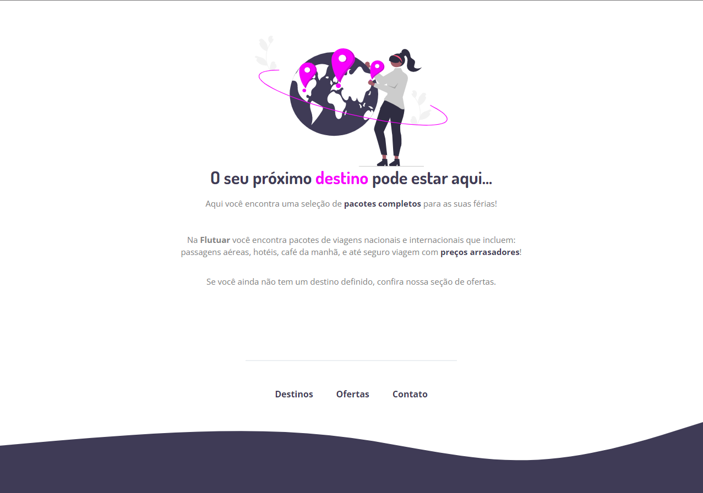

# <h1 align="center">Stage 02 - Extra Challenge</h1>

Extra Challenge | Stage 02 - Rockeseat Explorer course

  <a href="#-Technologies">Technologies</a>&nbsp;&nbsp;&nbsp;|&nbsp;&nbsp;&nbsp;
  <a href="#-Project">Project</a>&nbsp;&nbsp;&nbsp;|&nbsp;&nbsp;&nbsp;
  <a href="#-License">License</a>

  

## 🚀 Technologies

- HTML e CSS
- Git e Github
- Figma

## 💻 Project

You can preview the project layout [HERE](https://www.figma.com/file/QohpH0c6xoXcnESnZX3VV7/Projeto01-Extra-(Copy)?node-id=1-2&t=ycMWKLMlWKiPuHg7-0). You must have an account at [Figma](https://figma.com) to access it.

## 📝 License

  

 
